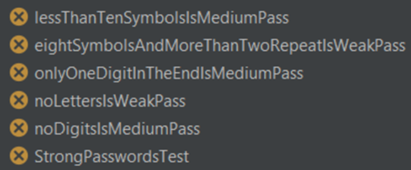
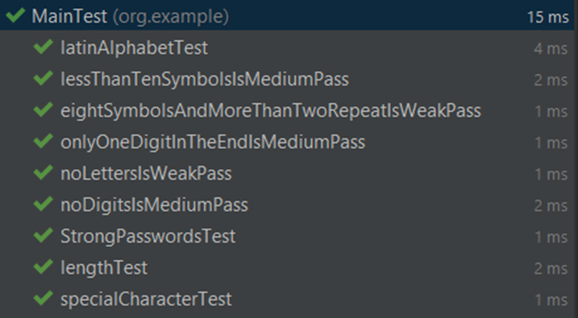
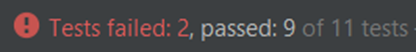
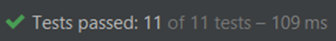

This project is a proprietary implementation of a user password validation algorithm.   
The main goal was not so much writing code as the desire to demonstrate in action one of the classic practices of extreme programming – test driven development.

The concept of TDD (Test Driven Development) is quite simple: Development is carried out in short cycles, each of which consists of 3 stages:
1) Writing tests covering the desired change
2) Writing the code that will allow you to pass the test
3) Refactoring the new code to the appropriate standards.

  

We will begin the development of our program by familiarizing ourselves with the requirements of the conditional customer's security service:

A password invented by the user:
1) Must not be shorter than 8 and longer than 22 characters
2) Contains letters exclusively of the Latin alphabet (if at all)
3) It must contain at least 1 special character  
   Special characters		 @ ! # $ % ^ & * ( ) — _ + = ; : , . / ? \ | ` ~ [ ] { }

A password is considered weak if:
1) Does not contain letters  
   or
2) Has a length of 8 characters and contains one character 3 or more times

A password is considered medium if:
1) Does not contain numbers  
   or
2) Consists of less than 10 characters  
   or
3) Contains only 1 digit, which stands at the end.

In all other cases, the password is considered strong.

Let's start writing tests.  
:warning: For clarity, we will store the password in a String type variable, which is not a good practice in real projects. :warning:

You can see the chronological order of writing the code of this project by clicking on the commit history.  
The first batch of tests will be devoted to the fact that an invalid password has been assigned the INCORRECT status.

It will be 3 tests:
1) The length of the password
2) To check if the letters in the password match the letters of the Latin alphabet
3) For the content of at least the 1st special character.

After writing the tests, we implement all these checks in the auxiliary private passwordIsCorrect() method, and use it in the main validatePassword() method.  
I implemented these checks using regular expressions.

  

After the tests have passed, we can move on to the 2nd iteration, since we don't need to refactor anything yet.

In the second iteration, I will write tests that will already test our password complexity assessment system.  
In total, there are 5 criteria in the requirements, according to which we assign a certain degree of reliability to a password, so we will write 5 tests according to these criteria and another additional one to test "reference" complex passwords.  
Of course, they all fail.

  

I wrote a simple code that consistently checks the password for compliance with all criteria using the replaceAll() method and regular expressions.  
And so, voila! All tests pass.

  

It would seem that this is all. We have written working code that passes all the tests and does its job correctly. But it's not like that. After launching our code into operation, it turned out the following:
1) Sometimes crashes occur, and an incorrect argument may arrive in our program, so you need to correctly process null and throw an IllegalArgumentException
2) The security service sent us a list of the 500 most frequently used passwords (file dangerous_passwords.txt ). Hackers will use these passwords first, so these passwords should be assigned the WEAK status.

So, let's start a new iteration.   
Let's write 2 tests, the first one will check that the IllegalArgumentException is thrown with the correct error message, the second one will check that passwords from the text file are not assigned the statuses MEDIUM and STRONG.  
We run our tests, make sure that they do not pass, and sit down to write code.

  

I have created a separate private static method that will check if the incoming string is a subset of the file strings dangerous_passwords.txt , and also slightly added a method for checking the password for correctness, adding a null check to it.

Result:

  

This project is quite simple in its structure, so I did not need refactoring after writing the code that passes the tests, but in large projects it may be necessary to make changes to the old code after receiving new requirements.
