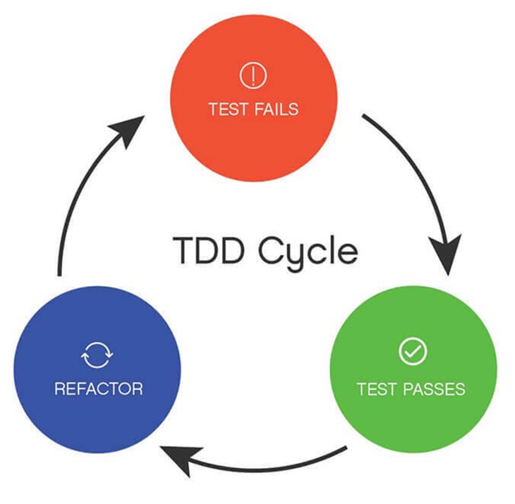
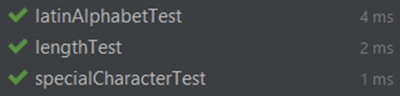
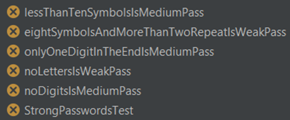
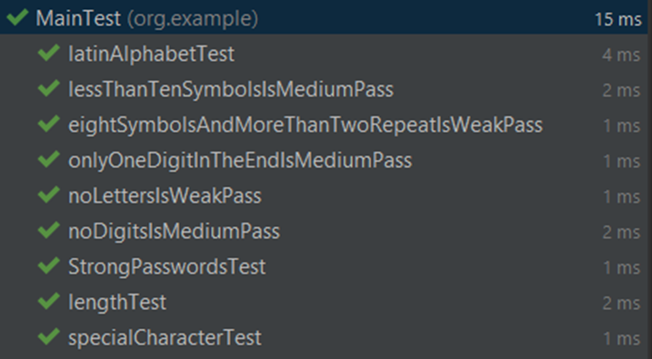
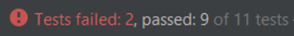

Данный проект – собственная реализация алгоритма валидации пользовательского пароля.
Главной целью было не столько написание кода, сколько желание продемонстрировать в действии одну из классических практик экстремального программирования – разработку через тестирование.

Концепция TDD (Test Driven Development) – достаточно проста: Разработка ведется короткими циклами, каждый из которых состоит из 3‑х стадий:
1)	Написание тестов, покрывающий желаемое изменение
2)	Написание кода, который позволит пройти тест
3)	Рефакторинг нового кода к соответствующим стандартам.

  

Начнем разработку нашей программы с ознакомления с требованиями службы безопасности условного заказчика:

Придуманный пользователем пароль:
1)	Не должен быть короче 8 и длиннее 22 символов
2)	Содержит буквы исключительно латинского алфавита (если вообще содержит)
3)	Обязательно содержит хотя бы 1 спецсимвол  
      Спецсимволы		 @ ! # $ % ^ & * ( ) — _ + = ; : , . / ? \ | ` ~ [ ] { }

Пароль считается слабым, если:
1)	Не содержит букв  
      или
2)	Имеет длину 8 символов и содержит один символ 3 или более раз

Пароль считается средним, если:
1)	Не содержит цифр  
      или
2)	Состоит менее чем из 10 символов  
      или
3)	Содержит только 1 цифру, которая стоит в конце.

Пароль в остальных случаях считается сильным.

Приступим к написанию тестов.  
:warning: Для наглядности мы будем хранить пароль в переменной типа String, что не является хорошей практикой в реальных проектах. :warning:

Хронологический порядок написания кода данного проекта вы можете посмотреть, кликнув по истории коммитов  
Первая пачка тестов будет посвящена тому, что бы недопустимым паролям был присвоен статус INCORRECT.
Это будет 3 теста:
1)	На длину пароля
2)	На проверку соответствию букв в пароле буквам латинского алфавита
3)	На содержание как минимум 1‑го спецсимвола.

После написания тестов реализуем все эти проверки во вспомогательном приватном методе passwordIsCorrect(), и используем его в основном методе validatePassword().  
Я реализовал данные проверки с помощью регулярных выражений.

  

После того как тесты прошли, мы можем переходить ко 2‑й итерации, так как рефакторить нам пока что ничего не нужно.

Во второй итерации я напишу тесты, которые уже будут проверять нашу систему оценки сложности пароля.  
Суммарно в требованиях 5 критериев, по которым мы присваиваем ту или иную степень надежность паролю, поэтому напишем 5 тестов по этим критериям и еще один дополнительный, для тестирования «эталонных» сложных паролей.
Разумеется, они все не проходят.

  

Я написал простой код, который последовательно проверяет пароль на соответствие всем критериям с помощью метода replaceAll() и регулярных выражений.  
И вот, вуаля! Все тесты проходят.

  

Казалось бы, что на этом все. Мы написали рабочий код, который проходит все тесты и корректно выполняет свою работу. Но как бы не так. После запуска нашего кода в работу, выяснилось следующее:
1)	Иногда случаются сбои, и в нашу программу может прилететь некорректный аргумент, поэтому нужно грамотно обработать null и пробрасывать IllegalArgumentException
2)	Служба безопасности прислала нам список 500 самых часто используемых паролей (файл dangerous_passwords.txt). Эти пароли взломщики будут использовать в первую очередь, поэтому данным паролям должен быть присвоен статус WEAK.

Итак, приступим к новой итерации.
Напишем 2 теста, первый будет проверять, что IllegalArgumentException пробрасывается с корректным сообщением ошибки, второй – проверять, что паролям из текстового файла не присваиваются статусы MEDIUM и STRONG.  
Запускаем наши тесты, удостоверяемся в том, что они не проходят, и садимся писать код.

  

Я создал отдельный приватный статический метод, который будет проверять, является ли входящая строка подмножеством строк файла dangerous_passwords.txt, а также немного дописал метод проверки пароля на корректность, добавив в него проверку на null.

Результат:

  

Данный проект достаточно прост по своей структуре, поэтому мне не понадобился рефакторинг после написания кода, проходящего тесты, но в больших проектах может потребоваться вносить изменения в старый код после получения новых требований.